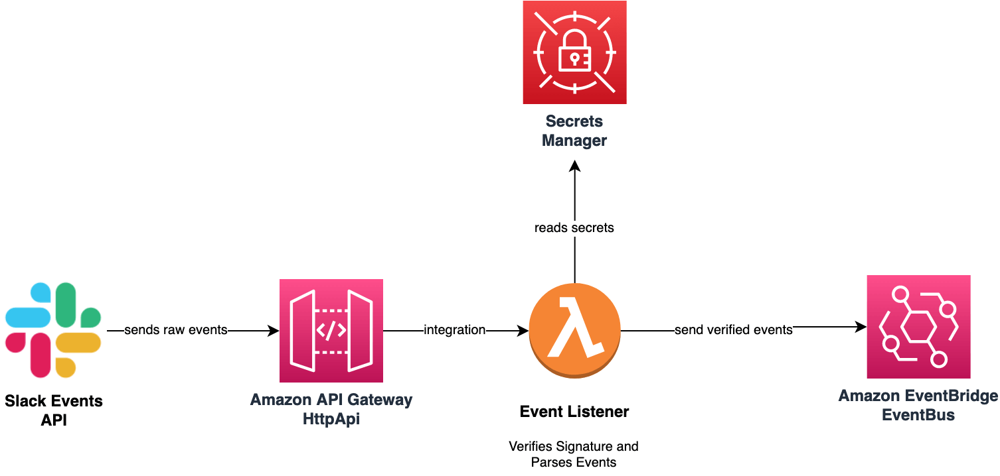

# @wisegpt/awscdk-slack-event-bus

<p align="center">
  <a href="/API.md"><strong>API</strong></a> ·
  <a href="https://github.com/WiseGPT/awscdk-slack-event-bus/releases"><strong>Changelog</strong></a>
</p>

<p align="center">
  <a href="https://opensource.org/licenses/Unlicense"></a>
  <a href="https://github.com/WiseGPT/awscdk-slack-event-bus/actions/workflows/build.yml"></a>
  <a href="https://github.com/WiseGPT/awscdk-slack-event-bus/actions/workflows/release.yml"></a>
</p>

<br/>

This library was created to fulfill the need of integrating Slack as a Event Source for [AWS EventBridge](https://aws.amazon.com/eventbridge/).

## Architecture


1. Creates an [EventBus](https://docs.aws.amazon.com/cdk/api/v1/docs/@aws-cdk_aws-events.EventBus.html) to send all Slack events to
2. Creates or uses an already existing [AWS HTTP API Gateway](https://docs.aws.amazon.com/apigateway/latest/developerguide/http-api.html) for exposing [Slack Events API Request URL](https://api.slack.com/apis/connections/events-api#the-events-api__subscribing-to-event-types__events-api-request-urls)
3. Creates an [AWS Lambda](https://aws.amazon.com/lambda/) and adds it to the [AWS HTTP API Gateway](https://docs.aws.amazon.com/apigateway/latest/developerguide/http-api.html) to be used as [Slack Events API Request URL](https://api.slack.com/apis/connections/events-api#the-events-api__subscribing-to-event-types__events-api-request-urls)
   1. **Lambda** validates the Signature of each received event
   2. **Lambda** responds to `url_verification` which is received when Slack App is configured with the Request URL
   3. **Lambda** sends all received events to the created **EventBus**
4. Can be used with a single Slack application or with multiple (by default).

## API Reference
See [API.md](/API.md) for documentation of the `SlackEventBus` construct.

## Example Usage

```typescript
import { CfnOutput, Stack, StackProps, SecretValue } from "aws-cdk-lib";
import { Secret } from "aws-cdk-lib/aws-secretsmanager";
import { Construct } from "constructs";
import { SlackEventBus } from "@wisegpt/awscdk-slack-event-bus";

export class MyExampleStack extends Stack {
  constructor(scope: Construct, id: string, props: StackProps = {}) {
    super(scope, id, props);

    const appId = "<<your-slack-app-id>>";
    // !IMPORTANT! you should reference `Secret` more securely, e.g. by using `Secret.fromSecretCompleteArn()`
    const secret = new Secret(this, "WiseGPTSecrets", {
      secretObjectValue: {
        [`app/${appId}/signing-secret`]: SecretValue.unsafePlainText("<<your-slack-signing-secret>>"),
      },
    });

    const slackEventBus = new SlackEventBus(this, "SlackEventBus", { secret });

    // ... use slackEventBus.eventBus to create rules to listen for events or do something else

    // Copy the output from the CLI or CloudFormation to enable Slack Events API
    new CfnOutput(this, "SlackEventRequestUrl", {
      value: slackEventBus.slackEventsRequestUrl(appId),
      description: "Slack Events Request Url to use in Slack API Dashboard",
    });
  }
}
```

## Event Mapping Detail

Received events are sent to the EventBus without any modification to their format. Some mapping from Slack Event to EventBridge Events is done to be able to put the event to the EventBus. Details are as follows;

- All events put to the EventBus have `source` field as `com.slack`
- Only `event_callback` and `app_rate_limited` type of events are sent to the EventBus.
- Extra Information on `event_callback` type of events:
  - The `Time` of the EventBus Event is set to the `event_time` of the Slack Event
  - The `DetailType` of the EventBus Event is set to `EventCallback.{event.type}` e.g. for `app_mention`, `DetailType` is `EventCallback.app_mention`
  - The `Detail` of the EventBus Event is set to the whole Event envelope that Slack has sent. E.g. `{ type: 'event_callback', event: { type: 'app_mention', ... }, ... }` the `token` field you would normally get from the Slack Event is omitted for security measure.
- Extra Information on `app_rate_limited` type of events:
  - The `Time` of the EventBus Event is set to the `minute_rate_limited` of the Slack Event
  - The `DetailType` of the EventBus Event is set to fixed `AppRateLimited`
  - The `Detail` of the EventBus Event is set to the whole Event envelope that Slack has sent. E.g. `{ type: 'app_rate_limited', api_app_id: ..., }` again, `token` is omitted for safety measure.

# API Reference <a name="API Reference" id="api-reference"></a>

## Constructs <a name="Constructs" id="Constructs"></a>

### SlackEventBus <a name="SlackEventBus" id="@wisegpt/awscdk-slack-event-bus.SlackEventBus"></a>

#### Initializers <a name="Initializers" id="@wisegpt/awscdk-slack-event-bus.SlackEventBus.Initializer"></a>

```typescript
import { SlackEventBus } from '@wisegpt/awscdk-slack-event-bus'

new SlackEventBus(scope: Construct, id: string, props: SlackEventBusProps)
```

| **Name** | **Type** | **Description** |
| --- | --- | --- |
| <code><a href="#@wisegpt/awscdk-slack-event-bus.SlackEventBus.Initializer.parameter.scope">scope</a></code> | <code>constructs.Construct</code> | *No description.* |
| <code><a href="#@wisegpt/awscdk-slack-event-bus.SlackEventBus.Initializer.parameter.id">id</a></code> | <code>string</code> | *No description.* |
| <code><a href="#@wisegpt/awscdk-slack-event-bus.SlackEventBus.Initializer.parameter.props">props</a></code> | <code><a href="#@wisegpt/awscdk-slack-event-bus.SlackEventBusProps">SlackEventBusProps</a></code> | *No description.* |

---

##### `scope`<sup>Required</sup> <a name="scope" id="@wisegpt/awscdk-slack-event-bus.SlackEventBus.Initializer.parameter.scope"></a>

- *Type:* constructs.Construct

---

##### `id`<sup>Required</sup> <a name="id" id="@wisegpt/awscdk-slack-event-bus.SlackEventBus.Initializer.parameter.id"></a>

- *Type:* string

---

##### `props`<sup>Required</sup> <a name="props" id="@wisegpt/awscdk-slack-event-bus.SlackEventBus.Initializer.parameter.props"></a>

- *Type:* <a href="#@wisegpt/awscdk-slack-event-bus.SlackEventBusProps">SlackEventBusProps</a>

---

#### Methods <a name="Methods" id="Methods"></a>

| **Name** | **Description** |
| --- | --- |
| <code><a href="#@wisegpt/awscdk-slack-event-bus.SlackEventBus.toString">toString</a></code> | Returns a string representation of this construct. |
| <code><a href="#@wisegpt/awscdk-slack-event-bus.SlackEventBus.slackEventsRequestUrl">slackEventsRequestUrl</a></code> | *No description.* |

---

##### `toString` <a name="toString" id="@wisegpt/awscdk-slack-event-bus.SlackEventBus.toString"></a>

```typescript
public toString(): string
```

Returns a string representation of this construct.

##### `slackEventsRequestUrl` <a name="slackEventsRequestUrl" id="@wisegpt/awscdk-slack-event-bus.SlackEventBus.slackEventsRequestUrl"></a>

```typescript
public slackEventsRequestUrl(appId?: string): string
```

###### `appId`<sup>Optional</sup> <a name="appId" id="@wisegpt/awscdk-slack-event-bus.SlackEventBus.slackEventsRequestUrl.parameter.appId"></a>

- *Type:* string

---

#### Static Functions <a name="Static Functions" id="Static Functions"></a>

| **Name** | **Description** |
| --- | --- |
| <code><a href="#@wisegpt/awscdk-slack-event-bus.SlackEventBus.isConstruct">isConstruct</a></code> | Checks if `x` is a construct. |

---

##### ~~`isConstruct`~~ <a name="isConstruct" id="@wisegpt/awscdk-slack-event-bus.SlackEventBus.isConstruct"></a>

```typescript
import { SlackEventBus } from '@wisegpt/awscdk-slack-event-bus'

SlackEventBus.isConstruct(x: any)
```

Checks if `x` is a construct.

###### `x`<sup>Required</sup> <a name="x" id="@wisegpt/awscdk-slack-event-bus.SlackEventBus.isConstruct.parameter.x"></a>

- *Type:* any

Any object.

---

#### Properties <a name="Properties" id="Properties"></a>

| **Name** | **Type** | **Description** |
| --- | --- | --- |
| <code><a href="#@wisegpt/awscdk-slack-event-bus.SlackEventBus.property.node">node</a></code> | <code>constructs.Node</code> | The tree node. |
| <code><a href="#@wisegpt/awscdk-slack-event-bus.SlackEventBus.property.eventBus">eventBus</a></code> | <code>aws-cdk-lib.aws_events.EventBus</code> | *No description.* |
| <code><a href="#@wisegpt/awscdk-slack-event-bus.SlackEventBus.property.slackHandlerLambdaAlias">slackHandlerLambdaAlias</a></code> | <code>aws-cdk-lib.aws_lambda.IFunction</code> | *No description.* |

---

##### `node`<sup>Required</sup> <a name="node" id="@wisegpt/awscdk-slack-event-bus.SlackEventBus.property.node"></a>

```typescript
public readonly node: Node;
```

- *Type:* constructs.Node

The tree node.

---

##### `eventBus`<sup>Required</sup> <a name="eventBus" id="@wisegpt/awscdk-slack-event-bus.SlackEventBus.property.eventBus"></a>

```typescript
public readonly eventBus: EventBus;
```

- *Type:* aws-cdk-lib.aws_events.EventBus

---

##### `slackHandlerLambdaAlias`<sup>Required</sup> <a name="slackHandlerLambdaAlias" id="@wisegpt/awscdk-slack-event-bus.SlackEventBus.property.slackHandlerLambdaAlias"></a>

```typescript
public readonly slackHandlerLambdaAlias: IFunction;
```

- *Type:* aws-cdk-lib.aws_lambda.IFunction

---


## Structs <a name="Structs" id="Structs"></a>

### SlackEventBusProps <a name="SlackEventBusProps" id="@wisegpt/awscdk-slack-event-bus.SlackEventBusProps"></a>

#### Initializer <a name="Initializer" id="@wisegpt/awscdk-slack-event-bus.SlackEventBusProps.Initializer"></a>

```typescript
import { SlackEventBusProps } from '@wisegpt/awscdk-slack-event-bus'

const slackEventBusProps: SlackEventBusProps = { ... }
```

#### Properties <a name="Properties" id="Properties"></a>

| **Name** | **Type** | **Description** |
| --- | --- | --- |
| <code><a href="#@wisegpt/awscdk-slack-event-bus.SlackEventBusProps.property.secret">secret</a></code> | <code>aws-cdk-lib.aws_secretsmanager.ISecret</code> | `secret` is a reference to the Secret parameter that stores the signing-secret and also if oAuth enabled; |
| <code><a href="#@wisegpt/awscdk-slack-event-bus.SlackEventBusProps.property.eventBusName">eventBusName</a></code> | <code>string</code> | `eventBusName` optional name to override the event bus name. |
| <code><a href="#@wisegpt/awscdk-slack-event-bus.SlackEventBusProps.property.httpApi">httpApi</a></code> | <code>@aws-cdk/aws-apigatewayv2-alpha.HttpApi</code> | `httpApi` optional HTTP API to use, instead of Construct creating a new one. |
| <code><a href="#@wisegpt/awscdk-slack-event-bus.SlackEventBusProps.property.singleApp">singleApp</a></code> | <code><a href="#@wisegpt/awscdk-slack-event-bus.SlackEventBusSingleAppProps">SlackEventBusSingleAppProps</a></code> | `singleApp` optionally configure to use a single application with fixed app id and path to use. |

---

##### `secret`<sup>Required</sup> <a name="secret" id="@wisegpt/awscdk-slack-event-bus.SlackEventBusProps.property.secret"></a>

```typescript
public readonly secret: ISecret;
```

- *Type:* aws-cdk-lib.aws_secretsmanager.ISecret

`secret` is a reference to the Secret parameter that stores the signing-secret and also if oAuth enabled;

client id / client secret for each individual appId

---

##### `eventBusName`<sup>Optional</sup> <a name="eventBusName" id="@wisegpt/awscdk-slack-event-bus.SlackEventBusProps.property.eventBusName"></a>

```typescript
public readonly eventBusName: string;
```

- *Type:* string

`eventBusName` optional name to override the event bus name.

---

##### `httpApi`<sup>Optional</sup> <a name="httpApi" id="@wisegpt/awscdk-slack-event-bus.SlackEventBusProps.property.httpApi"></a>

```typescript
public readonly httpApi: HttpApi;
```

- *Type:* @aws-cdk/aws-apigatewayv2-alpha.HttpApi

`httpApi` optional HTTP API to use, instead of Construct creating a new one.

---

##### `singleApp`<sup>Optional</sup> <a name="singleApp" id="@wisegpt/awscdk-slack-event-bus.SlackEventBusProps.property.singleApp"></a>

```typescript
public readonly singleApp: SlackEventBusSingleAppProps;
```

- *Type:* <a href="#@wisegpt/awscdk-slack-event-bus.SlackEventBusSingleAppProps">SlackEventBusSingleAppProps</a>

`singleApp` optionally configure to use a single application with fixed app id and path to use.

---

### SlackEventBusSingleAppProps <a name="SlackEventBusSingleAppProps" id="@wisegpt/awscdk-slack-event-bus.SlackEventBusSingleAppProps"></a>

#### Initializer <a name="Initializer" id="@wisegpt/awscdk-slack-event-bus.SlackEventBusSingleAppProps.Initializer"></a>

```typescript
import { SlackEventBusSingleAppProps } from '@wisegpt/awscdk-slack-event-bus'

const slackEventBusSingleAppProps: SlackEventBusSingleAppProps = { ... }
```

#### Properties <a name="Properties" id="Properties"></a>

| **Name** | **Type** | **Description** |
| --- | --- | --- |
| <code><a href="#@wisegpt/awscdk-slack-event-bus.SlackEventBusSingleAppProps.property.appId">appId</a></code> | <code>string</code> | `appId` to use for all request validating. |
| <code><a href="#@wisegpt/awscdk-slack-event-bus.SlackEventBusSingleAppProps.property.eventsApiPath">eventsApiPath</a></code> | <code>string</code> | `eventsApiPath` which would be used for the events path. |

---

##### `appId`<sup>Required</sup> <a name="appId" id="@wisegpt/awscdk-slack-event-bus.SlackEventBusSingleAppProps.property.appId"></a>

```typescript
public readonly appId: string;
```

- *Type:* string

`appId` to use for all request validating.

---

##### `eventsApiPath`<sup>Required</sup> <a name="eventsApiPath" id="@wisegpt/awscdk-slack-event-bus.SlackEventBusSingleAppProps.property.eventsApiPath"></a>

```typescript
public readonly eventsApiPath: string;
```

- *Type:* string

`eventsApiPath` which would be used for the events path.

---


