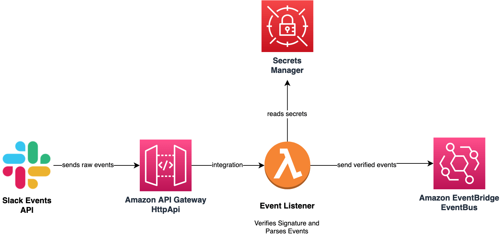

# @wisegpt/awscdk-slack-event-bus

<p align="center">
  <a href="/API.md"><strong>API</strong></a> ·
  <a href="https://github.com/WiseGPT/awscdk-slack-event-bus/releases"><strong>Changelog</strong></a>
</p>

<p align="center">
  <a href="https://opensource.org/licenses/Unlicense"></a>
  <a href="https://github.com/WiseGPT/awscdk-slack-event-bus/actions/workflows/build.yml"></a>
  <a href="https://github.com/WiseGPT/awscdk-slack-event-bus/actions/workflows/release.yml"></a>
</p>

<br/>

This library was created to fulfill the need of integrating Slack as a Event Source for [AWS EventBridge](https://aws.amazon.com/eventbridge/).

## Architecture


1. Creates an [EventBus](https://docs.aws.amazon.com/cdk/api/v1/docs/@aws-cdk_aws-events.EventBus.html) to send all Slack events to
2. Creates [AWS HTTP API Gateway](https://docs.aws.amazon.com/apigateway/latest/developerguide/http-api.html) for exposing [Slack Events API Request URL](https://api.slack.com/apis/connections/events-api#the-events-api__subscribing-to-event-types__events-api-request-urls)
3. Exposes an [AWS Lambda](https://aws.amazon.com/lambda/) via [AWS HTTP API Gateway](https://docs.aws.amazon.com/apigateway/latest/developerguide/http-api.html) to be used as [Slack Events API Request URL](https://api.slack.com/apis/connections/events-api#the-events-api__subscribing-to-event-types__events-api-request-urls)
   1. **Lambda** validates the Signature of each received event
   2. **Lambda** responds to `url_verification` which is received when Slack App is configured with the Request URL
   3. **Lambda** sends all received events to the created **EventBus**


## Example Usage

```typescript 
import { CfnOutput, Stack, StackProps, SecretValue } from "aws-cdk-lib";
import { Secret } from "aws-cdk-lib/aws-secretsmanager";
import { Construct } from "constructs";
import { SlackEventBus } from "@wisegpt/awscdk-slack-event-bus";

export class MyExampleStack extends Stack {
  constructor(scope: Construct, id: string, props: StackProps = {}) {
    super(scope, id, props);

    const appId = "<<your-slack-app-id>>";
    // !IMPORTANT! you should reference `Secret` more securely, e.g. by using `Secret.fromSecretCompleteArn()`
    const tokenSecret = new Secret(this, "WiseGPTSecrets", {
      secretObjectValue: {
        [`app/${appId}/signing-secret`]: SecretValue.unsafePlainText("<<your-slack-signing-secret>>"),
      },
    });

    const slackEventBus = new SlackEventBus(this, "SlackEventBus", { tokenSecret: tokenSecret });
    
    // ... use slackEventBus.eventBus to create rules to listen for events or do something else

    // Copy the output from the CLI or CloudFormation to enable Slack Events API
    new CfnOutput(this, "SlackEventRequestUrl", {
      value: slackEventBus.slackEventsRequestUrl(appId),
      description: "Slack Events Request Url to use in Slack API Dashboard",
    });
  }
}
```

## Event Mapping Detail

Received events are sent to the EventBus without any modification to their format. Some mapping from Slack Event to EventBridge Events is done to be able to put the event to the EventBus. Details are as follows;

- All events put to the EventBus have `source` field as `com.slack`
- Only `event_callback` and `app_rate_limited` type of events are sent to the EventBus.
- Extra Information on `event_callback` type of events:
  - The `Time` of the EventBus Event is set to the `event_time` of the Slack Event
  - The `DetailType` of the EventBus Event is set to `EventCallback.{event.type}` e.g. for `app_mention`, `DetailType` is `EventCallback.app_mention`
  - The `Detail` of the EventBus Event is set to the whole Event envelope that Slack has sent. E.g. `{ type: 'event_callback', event: { type: 'app_mention', ... }, ... }` the `token` field you would normally get from the Slack Event is omitted for security measure.
- Extra Information on `app_rate_limited` type of events:
  - The `Time` of the EventBus Event is set to the `minute_rate_limited` of the Slack Event
  - The `DetailType` of the EventBus Event is set to fixed `AppRateLimited`
  - The `Detail` of the EventBus Event is set to the whole Event envelope that Slack has sent. E.g. `{ type: 'app_rate_limited', api_app_id: ..., }` again, `token` is omitted for safety measure.
